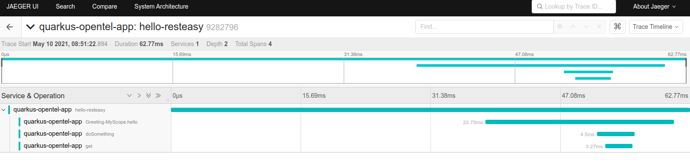

# Quarkus + RestEasyReactive + OpenTelemetry with Kotlin Coroutines

This application was created to evaluate the use of Quarkus
with OpenTelemetry to trace the code steps inside a Web Application
developed with Quarkus using Kotlin with Coroutines.

Quarkus Applications created using RestEasy + Open Telemetry works ok, creating sub-spans
for each method called automatically. However, when replacing RestEasy
with RestEasyReactive, such automatically generated subspans were not working.

First, we tried to create a custom annotation to mark methods we want to trace and
so, we configured a interceptor to add child spans for these annotated methods.

In Quarkus 1, unfortunately we couldn't append these child spans with the `SERVER` root span
generated by the quarkus-opentelemetry, because we are using Coroutines and only in Quarkus 2, 
the Quarkus Scope is propagated correctly through the coroutines scopes.

So, in ou method scope.asyncUni, we created an artificial parent span, given a name passed through a parameter
to the scope.asyncUni method, so the child spans would be aggregated bellow this span created in asyncUni.

We tested on Quarkus 2 (which is yet in alpha version) and in the incoming Quarkus version it worked
get the OpenTelemetry current context inside the Coroutines scope, so we would remove the artificial root
span and would aggregate the child spans in the `SERVER` root span. Looks like there were a issue
on quarkus resteasy reactive on Quarkus 1, which prevents to get the request scope inside reactive resteasy context, 
as evidenced in this issue https://github.com/quarkusio/quarkus/issues/13262. The problem was
solved in Quarkus 2 ()

If you change the gradle.properties to use the 1.13.3.Final version, you will see this logged
in Terminal Console when triggering requests to `http://localhost:8080/hello-resteasy`

```
...
MISSING INJECTED REQUEST
THREAD INSTANCE (DocumentService.get): 116Document: {id=1, name=Document: 1}
```

Using Quarkus version 2.0.0.Alpha2, sending requests to `http://localhost:8080/hello-resteasy` you'll
see something like the piece bellow, indicating the `CurrentVertxRequest` was correctly being injected: 

```
INJECTED REQUEST
REQUEST DATA: {io.quarkus.opentelemetry.QuarkusContextStorage.activeContext={opentelemetry-trace-span-key=RecordEventsReadableSpan{traceId=71906174bb7e1772feae03de753a785a, spanId=029cec7e3b7d58ac, parentSpanContext=ImmutableSpanContext{traceId=00000000000000000000000000000000, spanId=0000000000000000, traceFlags=00, traceState=ArrayBasedTraceState{entries=[]}, remote=false, valid=false}, name=hello-resteasy, kind=SERVER, attributes=AttributesMap{data={http.target=/hello-resteasy, http.flavor=1.1, http.user_agent=Mozilla/5.0 (X11; Linux x86_64) AppleWebKit/537.36 (KHTML, like Gecko) Chrome/85.0.4183.102 Safari/537.36, http.request_content_length=0, http.method=GET, http.client_ip=127.0.0.1, http.scheme=http, http.host=localhost:8080}, capacity=128, totalAddedValues=8}, status=ImmutableStatusData{statusCode=UNSET, description=}, totalRecordedEvents=0, totalRecordedLinks=0, startEpochNanos=1620594800099842397, endEpochNanos=0}}, io.quarkus.vertx.http.runtime.security.HttpAuthenticator=io.quarkus.vertx.http.runtime.security.HttpAuthenticator_Subclass@270065c9, io.quarkus.vertx.http.deferred-identity=io.smallrye.mutiny.operators.uni.builders.UniCreateFromKnownItem@2bd752b9, io.quarkus.max-request-size=10485760, io.quarkus.vertx.http.auth-failure-handler=io.quarkus.vertx.http.runtime.security.HttpSecurityRecorder$2$1@555777cc}
THREAD INSTANCE (DocumentService.get): 124Document: {id=1, name=Document: 1}
```

## Capture with Jaeger + Custom Span capture with annotation



# Instructions

This project uses Quarkus, the Supersonic Subatomic Java Framework.

If you want to learn more about Quarkus, please visit its website: https://quarkus.io/ .

## Running the application in dev mode

You can run your application in dev mode that enables live coding using:
```shell script
./gradlew quarkusDev
```

## Packaging and running the application

The application can be packaged using:
```shell script
./gradlew build
```
It produces the `code-with-quarkus-1.0.0-SNAPSHOT-runner.jar` file in the `/build` directory.
Be aware that it’s not an _über-jar_ as the dependencies are copied into the `build/lib` directory.

If you want to build an _über-jar_, execute the following command:
```shell script
./gradlew build -Dquarkus.package.type=uber-jar
```

The application is now runnable using `java -jar build/code-with-quarkus-1.0.0-SNAPSHOT-runner.jar`.

## Creating a native executable

You can create a native executable using: 
```shell script
./gradlew build -Dquarkus.package.type=native
```

Or, if you don't have GraalVM installed, you can run the native executable build in a container using: 
```shell script
./gradlew build -Dquarkus.package.type=native -Dquarkus.native.container-build=true
```

You can then execute your native executable with: `./build/code-with-quarkus-1.0.0-SNAPSHOT-runner`

If you want to learn more about building native executables, please consult https://quarkus.io/guides/gradle-tooling.

# RESTEasy JAX-RS

<p>A Hello World RESTEasy resource</p>

Guide: https://quarkus.io/guides/rest-json

# RESTEasy JSON serialisation using Jackson

<p>This example demonstrate RESTEasy JSON serialisation by letting you list, add and remove quark types from a list.</p>
<p><b>Quarked!</b></p>

Guide: https://quarkus.io/guides/rest-json
